# Trackit

[](https://github.com/fadyshenouda613/New-folder--2-/releases/latest)
[](https://github.com/fadyshenouda613/New-folder--2-/releases/latest)
[](https://github.com/fadyshenouda613/New-folder--2-/actions/workflows/ci.yml)

**Freelance time and billing for people who charge a fixed price.**

Trackit is an Electron desktop app that tracks hours against fixed-price
projects and tells you what you are *actually* earning per hour — then turns
delivered work into an invoice and follows the money until it lands.

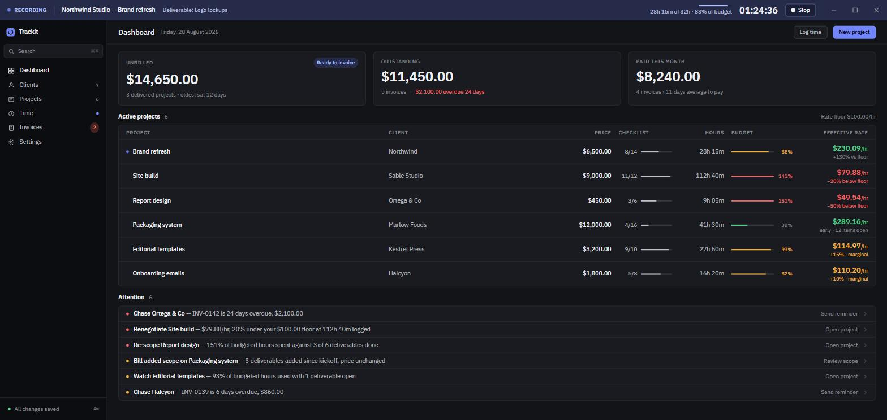

---

## Install

Installers for every release are on the
[latest release](https://github.com/fadyshenouda613/New-folder--2-/releases/latest)
page:

| Platform | File |
|---|---|
| Windows 10/11 (x64) | `Trackit-Setup-<version>.exe` — a one-click installer, per user, no admin prompt |
| macOS (Apple silicon) | `Trackit-<version>-arm64.dmg` |
| macOS (Intel) | `Trackit-<version>-x64.dmg` |

**The builds are not code-signed**, so each OS shows a warning the first
time. It is the same warning every unsigned app gets; here is how to get past
it.

**Windows.** SmartScreen shows *"Windows protected your PC"*. Click **More
info**, then **Run anyway**. The installer puts the app in
`%LOCALAPPDATA%Programs	rackit` and adds a Start Menu entry; uninstall it
from *Settings → Apps* like anything else.

**macOS.** Open the DMG and drag Trackit into *Applications*. The first launch
is refused with *"Trackit cannot be opened because it is from an unidentified
developer"* (or *"…Apple could not verify…"* on macOS 15). Either:

- **Control-click** the app in *Applications* and choose **Open**, then **Open**
  again in the dialog — macOS remembers the choice; or
- on macOS 15 and later, try to open it once, then go to *System Settings →
  Privacy & Security*, scroll to the message about Trackit and click **Open
  Anyway**; or
- clear the quarantine flag from a terminal:
  `xattr -dr com.apple.quarantine /Applications/Trackit.app`.

**Where your data lives.** Everything is in one SQLite file in the app's
per-user data directory — `%APPDATA%Trackit	rackit.db` on Windows,
`~/Library/Application Support/Trackit/trackit.db` on macOS. Uninstalling
leaves it in place.

**Updates.** Trackit checks this repository's releases shortly after launch
and a few times a day. On Windows a newer build downloads in the background
and a notice offers a restart (a running timer is stopped and logged first).
On macOS an unsigned app cannot replace itself, so the notice links to the
download instead; drop the new app over the old one and your data stays
where it is.

---

## Status

This repository is a **complete, working UI build** of the app — every screen,
dialog, notice and empty state is designed, implemented and reachable. What is
*not* here yet is a backend:

- There is **no database**. Clients, projects, time entries and invoices are
  seeded fixtures the running app mutates in memory. A reload resets them.
- There is **no sync service**. The sync footer walks its real states, but
  nothing is uploaded anywhere.
- There is **no account service**. Any email plus `admin` / `admin` signs you in.

Two things genuinely persist across launches, in `localStorage`: your theme
preference (`trackit.theme`) and the fact that you are signed in
(`trackit.session`, `trackit.welcome-seen`).

Everything below is real, running code — the screenshots are captures of the
app, not mockups.

---

## The idea

Fixed-price work hides its own margin. You agree $6,500 for a brand refresh,
the scope quietly grows, and you find out months later that you worked for $49
an hour. Trackit's whole job is to make that visible *while there is still time
to act*:

- Every project carries an **agreed price** and an **hours budget**.
- Every hour you log recalculates the **effective rate** — price ÷ hours.
- You set a **rate floor**. Anything below it is drawn in red, everywhere.
- The dashboard's **Attention** list names the specific thing to do about it:
  renegotiate, re-scope, bill the added scope, chase the overdue invoice.

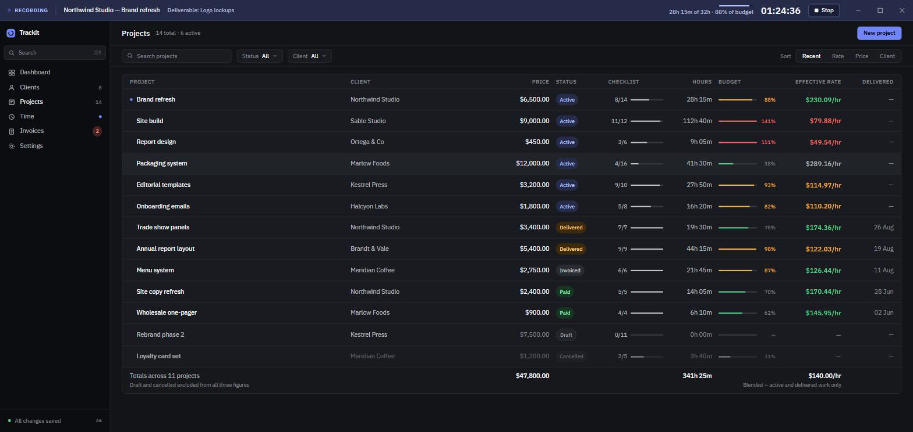

Fourteen projects, each with its price, checklist progress, hours against
budget, and effective rate against the floor. The blended rate sits in the
footer.

---

## Features

### Time tracking

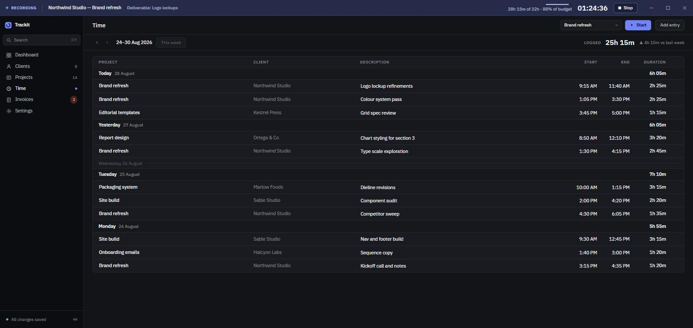

A running timer lives in the window chrome above everything else, showing the
client, the project, the deliverable, elapsed time, and how much of the budget
it has eaten. Stop it and it tells you what it just logged.

The week view groups entries by day with per-day and per-week totals, and
compares the week against the last one.

**Over budget** turns the whole bar red and switches the readout from
*"88% of budget"* to *"40m over"*:

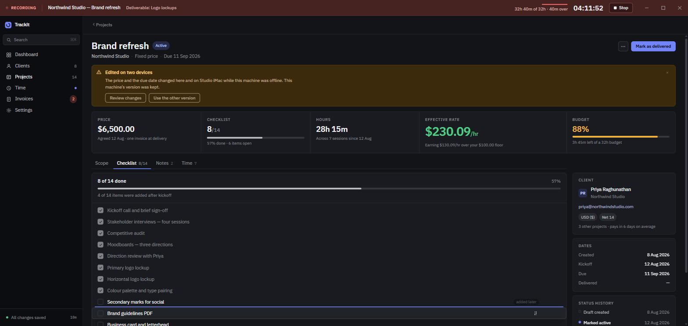

*(Also shown: the two-device edit conflict notice.)*

**Crash recovery.** If the app quits with a timer running, the next launch asks
what to do with the orphaned run rather than silently keeping or dropping it:

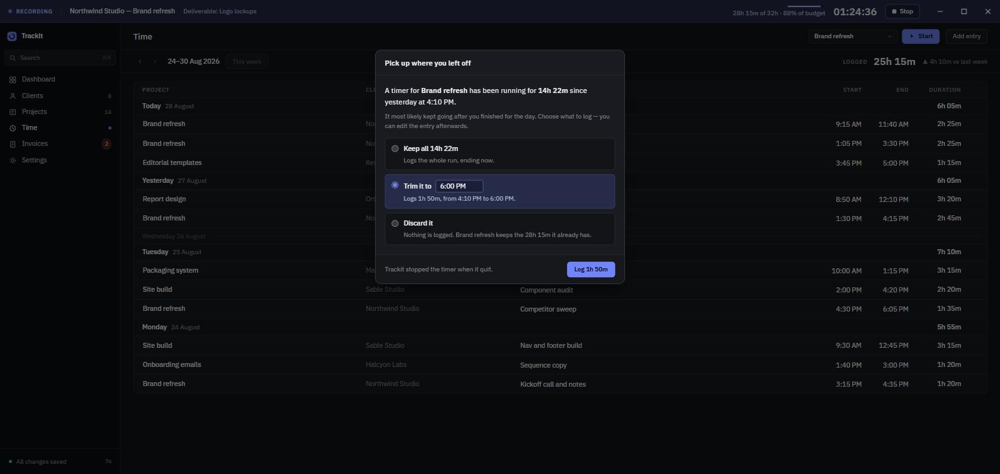

### Projects and scope creep

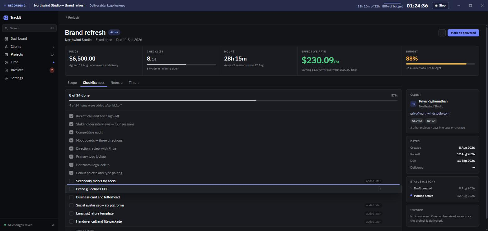

Each project has a price, a deliverable checklist, an hours budget, notes, and
its own time log. Items added after kickoff are tagged **added later** — so
"4 of 14 items were added after kickoff" is a sentence you can take to a client
rather than a feeling you have. Checklist items reorder by drag.

Creating a project shows you the deal you are agreeing to *before* you agree to
it — price ÷ estimated hours, checked against your floor:

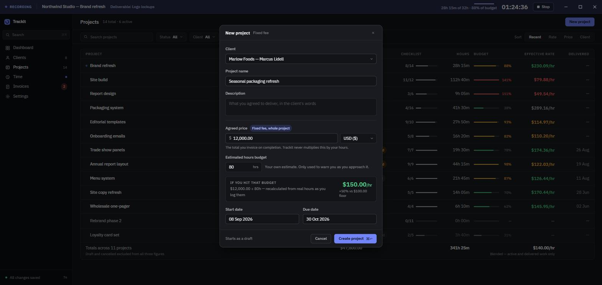

### Clients

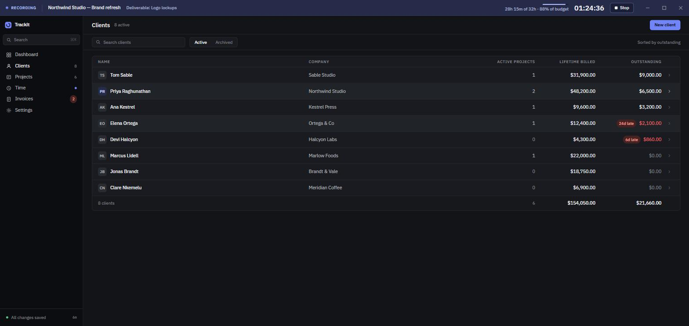

Sorted by outstanding, with lifetime billed, active project count, and how late
each debt is.

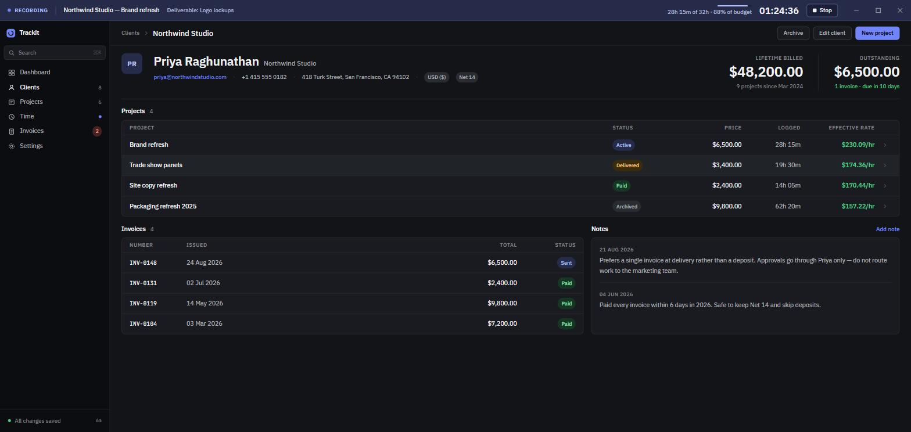

A client's record pulls together their projects, their invoices, how fast they
actually pay, and free-text notes.

### Invoicing

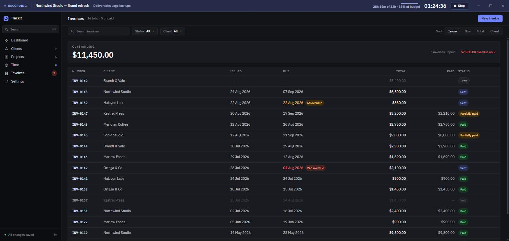

The register: draft, sent, partially paid, paid, void and overdue, with search,
status and client filters, and an outstanding total that includes how much is
overdue and on how many invoices.

**Building an invoice** starts from what is delivered and not yet billed.
Tick the projects; anything already on an invoice is shown but locked, so
nothing gets billed twice. Lines can be reworded, repriced and reordered:

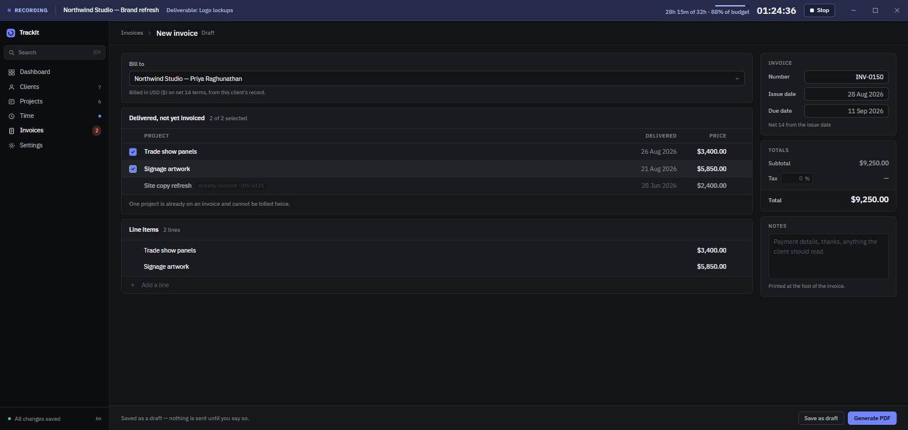

**The invoice record** shows the document, its payment history, and the actions
available given its state:

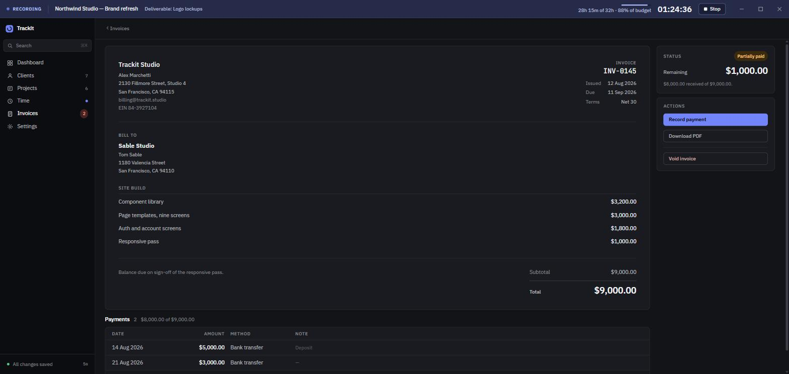

**Recording a payment** opens at the full outstanding amount and tells you the
balance after it lands before you commit:

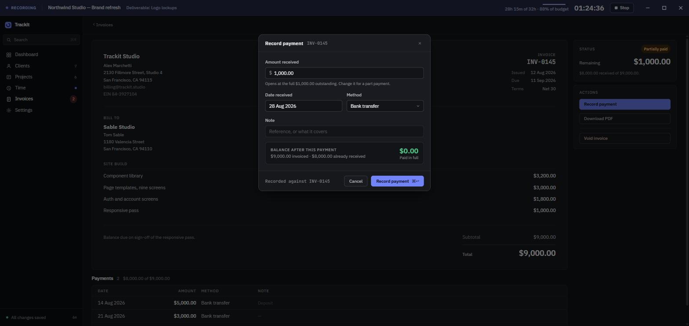

**The printed artefact** — grouped by project, with subtotals, tax and payment
terms. This is the thing the client receives, so it is rendered without any of
the app's chrome:

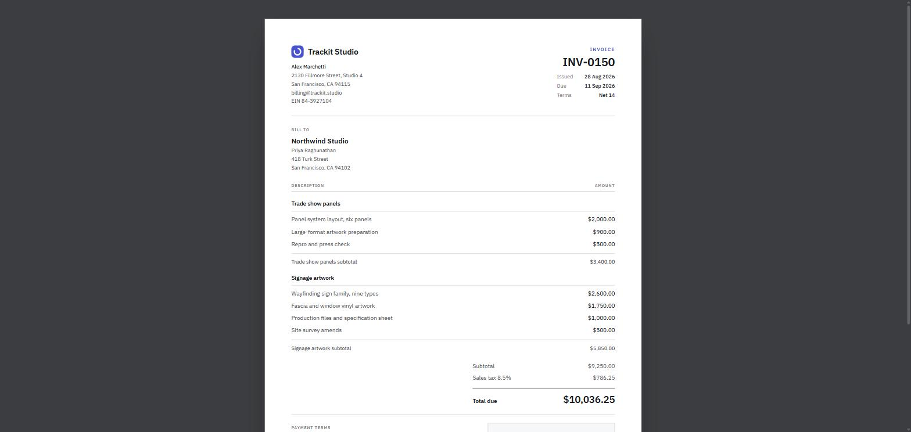

### Settings

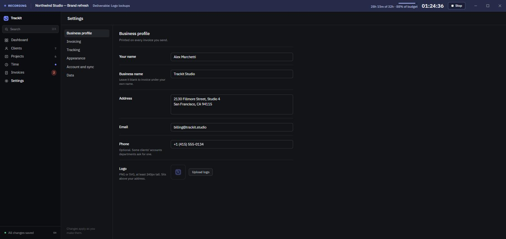

Six panes: **Business profile** (what gets printed on every invoice),
**Invoicing** (currency, tax rate, payment terms, and a numbering scheme that
understands `{YYYY}`, `{YY}`, `{MM}` and a zero-run counter — `INV-0000` and
`INV-000000` differ only in width), **Tracking** (the rate floor and the global
timer shortcut), **Appearance**, **Account and sync**, and **Data**.

### Notices, toasts and states

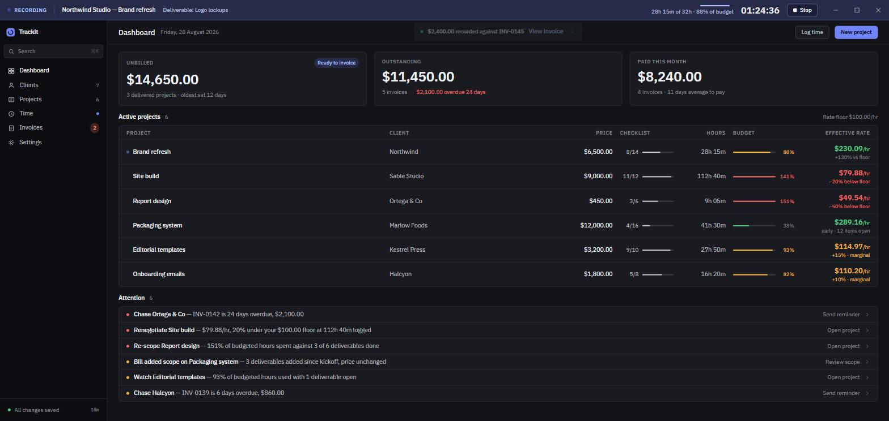

Actions confirm themselves and stay actionable — the toast above names the
amount and the invoice it landed on, and links straight to it. The sidebar
footer carries four distinct sync states (`saved`, `syncing`, `pending`,
`failed`) because *"work is queued"* and *"the last attempt failed"* are
different situations that need different responses.

### First run

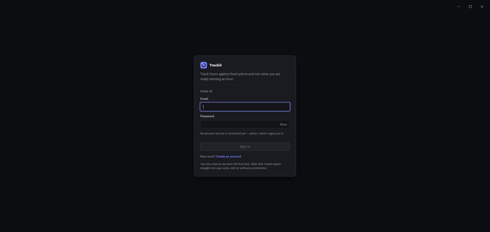

You only need an account the first time; after that Trackit opens straight into
your work, online or not.

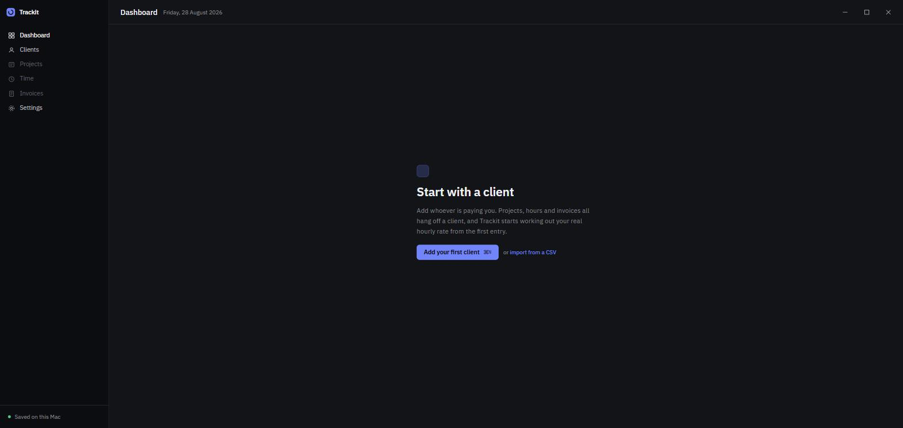

A new account starts with one thing to do, and the sidebar dims everything that
does not exist yet.

---

## Dark and light

Trackit ships both themes as first-class designs — not a filter over one
palette. Every colour is an `oklch()` token in
[`apps/desktop/src/renderer/src/styles/tokens.css`](apps/desktop/src/renderer/src/styles/tokens.css); no
component file contains a raw colour. The light theme redefines the tokens, and
inverts the ones that have to go the other way (hover, for instance, steps
*down* in light and *up* in dark).

| Dark | Light |
|---|---|
|  | 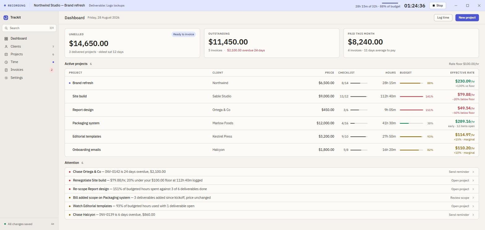 |
|  | 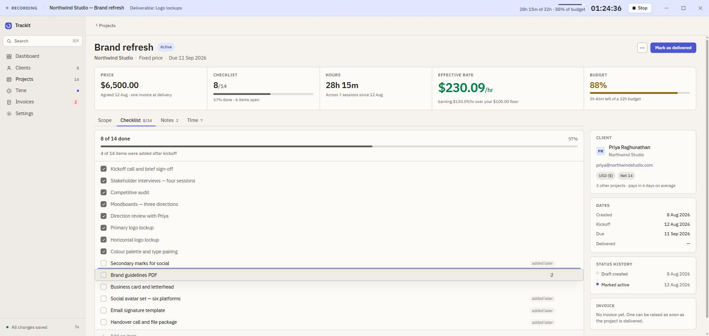 |
|  | 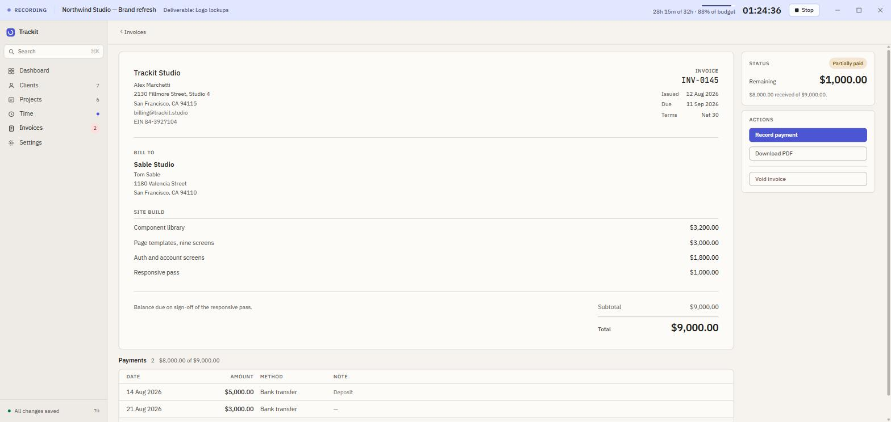 |

Choose Light, Dark or System in **Settings → Appearance**:

| Dark | Light |
|---|---|
| 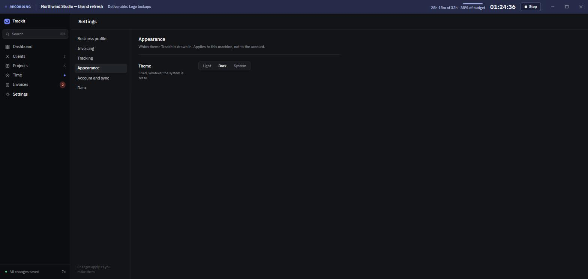 | 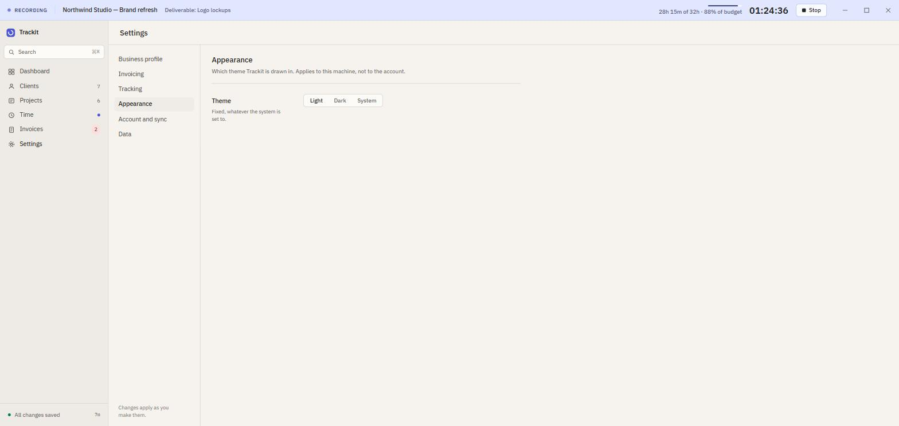 |

Three details make the switch feel native rather than bolted on:

1. **No flash of the wrong theme.** `apps/desktop/src/renderer/public/theme-boot.js` is a
   classic (non-module, non-deferred) script in `<head>` that stamps
   `data-theme` from `localStorage` before the first paint.
2. **The OS is followed live.** "System" is a standing instruction, not a third
   palette — a `matchMedia` listener repaints when the OS flips.
3. **The native window follows too.** The preference is sent to the main
   process over IPC and handed verbatim to Electron's `nativeTheme`, which
   tints macOS traffic lights and native menus. The window's own
   `backgroundColor` is repainted to match, so a resize never flashes a dark
   slab behind a light app.

---

## Desktop integration

**Frameless on every platform.** On macOS the traffic lights stay, inset into
the app's own chrome; on Windows and Linux the renderer draws its own controls
and talks to the main process over IPC.

**Menu-bar / tray timer.** The tray glyph is the app's recording dot — filled
while a timer runs, hollow while it does not — so the menu bar answers the
question without being opened. Its menu carries the current project, a live
elapsed clock, and Start/Stop. On macOS the elapsed time also sits beside the
icon. Both the tray glyph and the app icon are rasterized in code
(`apps/desktop/src/main/tray.ts`, `apps/desktop/src/main/icon.ts`) rather than shipped as build assets, so
they cannot drift out of sync with `Logo.tsx`.

**Global shortcut.** <kbd>Ctrl</kbd>/<kbd>⌘</kbd> + <kbd>Shift</kbd> +
<kbd>S</kbd> toggles the timer from anywhere. If the binding is already taken,
the app logs a warning rather than showing a hint that does nothing.

**Security.** `contextIsolation: true`, `nodeIntegration: false`, a strict CSP
in `index.html`, and a preload bridge that exposes exactly six window methods
and the platform string — nothing else (see
[`packages/shared/src/api.ts`](packages/shared/src/api.ts)). External links open in the real
browser, never in an app window.

---

## Getting started

**Requirements** — Node 20.19+ or 22.12+ (Vite 7's baseline; developed on
v24.13.0).

```bash
npm install      # installs every workspace
npm run dev      # electron-vite dev — launches the app with HMR
```

The root scripts delegate to the desktop workspace, so everything below runs
from the repository root.

`npm run dev` also serves the renderer at <http://localhost:5173>. Opening that
URL in a browser works: `apps/desktop/src/renderer/src/bridge.ts` supplies a no-op stand-in
for the preload bridge, so everything but the native window controls behaves
normally. (That is how the screenshots above were taken.)

Signing in needs the account server running — see [Accounts and the
server](#accounts-and-the-server) below. Without it the sign-in card says it
could not reach your account; the **States** panel's Account row can still
force the app open, and everything behind the front door works with no
account at all.

| Command | What it does |
|---|---|
| `npm run dev` | Dev server + Electron, with hot reload |
| `npm run build` | Build main, preload and renderer into `out/` |
| `npm start` | `electron-vite preview` — run the built app |
| `npm run typecheck` | Type-check every workspace |
| `npm run typecheck:node -w @trackit/desktop` | Main and preload only |
| `npm run typecheck:web -w @trackit/desktop` | Renderer only |
| `npm run package -w @trackit/desktop` | Build, then produce this platform's installer in `apps/desktop/dist/` |

### Accounts and the server

`apps/server` is an Express 5 + PostgreSQL service (Drizzle ORM) that holds
accounts today and will hold the sync engine next. The desktop's sign-in and
sign-up cards call it; nothing else does yet. Your work never leaves the
machine until sync exists, and an account is never needed to read or write
it — an expired session only stops syncing.

```bash
cd apps/server
docker compose up -d                 # Postgres 16 on port 5433
cp .env.example .env                 # then set JWT_SECRET (32+ characters)
npm run dev                          # tsx watch, http://localhost:4000
npm run test:integration             # the auth routes against that Postgres
```

Routes: `POST /auth/register`, `/auth/login`, `/auth/refresh`, `/auth/logout`,
`GET /auth/me`, and `/health`. Passwords are argon2id hashes. An access token
is a 15-minute JWT; the refresh token that earns the next one is rotated on
every use, stored only as a hash, and revoking one revokes its whole family —
so a refresh token that turns up twice signs that session out everywhere.
Every failure is `{ "error": { "code", "message" } }`, never a stack trace.

The desktop keeps the refresh token in `session.json` beside the database,
encrypted with the OS keychain (Electron's `safeStorage`). It refreshes in the
background on launch; a machine that cannot reach the server stays signed in,
and one the server refuses shows *Session expired* under **Settings →
Account** without touching the local data. Point a development build at
another server with `TRACKIT_SERVER_URL`; a packaged build reads
`MAIN_VITE_SERVER_URL` from `apps/desktop/.env` at build time. The default is
`http://127.0.0.1:4000`.

Schema changes are new files under `apps/server/drizzle/` from
`npm run db:generate -w @trackit/server`; the server applies them at start.
Deploy from `apps/server/Dockerfile` — `railway.json` and `render.yaml` at
the root are ready-made for Railway and Render, and `.env.example` lists
every variable. CI runs the integration tests against a Postgres service and
builds the image on every push.

### Packaging and releases

`npm run package` in the desktop workspace runs the build and then
[electron-builder](https://www.electron.build/) from
`apps/desktop/electron-builder.yml`: an NSIS installer on Windows, a DMG (plus
the zip the updater reads) on macOS. The app icon is not a checked-in asset —
`apps/desktop/tooling/icons.ts` draws the `.ico` and `.icns` from the same
geometry as the window icon (`src/main/mark.ts`) at the start of every build.
better-sqlite3 ships a Node-API prebuild, so nothing is rebuilt against
Electron; the package unpacks it beside the asar and `require` finds it there.

Releases are cut by tag. Pushing `vX.Y.Z` (matching the version in
`apps/desktop/package.json`) runs `.github/workflows/release.yml`, which builds
on a Windows and a macOS runner, attaches the installers and the
`latest*.yml` feed files to a draft GitHub Release, and publishes it once both
have uploaded. `.github/workflows/ci.yml` runs the type-checker and the tests
on every push and pull request.

In-app updates come from [electron-updater](https://www.electron.build/auto-update)
reading that same release feed (`apps/desktop/src/main/updates.ts`); the
renderer only ever sees a status value over the bridge.

### The States panel

Because there is no data layer, some states are unreachable by navigating —
the empty account, a failed sync, an orphaned timer, a void invoice, a loading
skeleton. A dev panel covers all of them. Click **States** in the bottom-right
corner of the window and you get eight axes:

| Axis | Options |
|---|---|
| Screen | 17, including every dialog and the printed invoice |
| Account | In, Sign in, Sign up, Welcome, Offline |
| Timer | Stopped, Running, Over budget |
| Sync | Saved, Syncing, Pending, Failed |
| Notice | None, Conflict, Reorder, Update, Download |
| Data | Ready, Loading |
| Toast | PDF, Payment, Delivered, Timer *(fires rather than selects)* |
| Theme | Dark, Light, System |

It lives in [`apps/desktop/src/renderer/src/dev/StatePanel.tsx`](apps/desktop/src/renderer/src/dev/StatePanel.tsx)
and is the fastest way to see the whole app.

---

## Project structure

The repository is an npm workspace: the desktop app and the (future) server
share code through `packages/shared`.

```
apps/
├── desktop/                       @trackit/desktop — the Electron app
│   ├── electron.vite.config.ts
│   ├── tsconfig.node.json           main + preload
│   ├── tsconfig.web.json            renderer
│   └── src/
│       ├── main/                    Electron main process
│       │   ├── index.ts               App lifecycle, tray timer state
│       │   ├── window.ts              Frameless BrowserWindow, per-theme background fill
│       │   ├── ipc.ts                 Window controls + nativeTheme sync
│       │   ├── tray.ts                Tray icon, menu, global shortcut
│       │   └── icon.ts                App icon, rasterized from Logo.tsx's geometry
│       ├── preload/index.ts         contextBridge → window.ledger
│       └── renderer/
│           ├── index.html             CSP + pre-paint theme boot
│           ├── public/theme-boot.js   Stamps data-theme before the first paint
│           └── src/
│               ├── App.tsx            Screen routing and the state that crosses screens
│               ├── bridge.ts          The preload bridge, with a browser stand-in
│               ├── components/        62 components + 14 data/helper modules
│               ├── dev/StatePanel.tsx
│               └── styles/
│                   ├── tokens.css     Ledgerline design system — the token layer
│                   └── app.css        Everything drawn from those tokens
└── server/                        @trackit/server — Express 5 + PostgreSQL
    ├── Dockerfile                   Built from the repository root
    ├── docker-compose.yml           Postgres 16 for development and the tests
    ├── drizzle/                     Numbered migrations, generated by drizzle-kit
    └── src/
        ├── index.ts                 Config, migrate, listen, graceful stop
        ├── app.ts                   The Express app: helmet, cors, routes, error handler
        ├── config.ts                Every environment variable, checked once
        ├── errors.ts                One error shape for every failure
        ├── db/schema.ts             The SQLite tables mirrored, plus user_id and server_seq
        └── auth/                    Argon2 accounts, JWT access, rotating refresh tokens
packages/
└── shared/                        @trackit/shared — what desktop and server agree on
    └── src/
        ├── api.ts                   The preload bridge contract
        └── schemas/                 Every entity, once, as a Zod schema
```

**Stack:** Electron 44, React 19, TypeScript 5.9, Vite 7 via electron-vite 5,
Zod 4 for schemas, npm workspaces; on the server, Express 5, Drizzle ORM over
PostgreSQL 16, argon2 and jose. No UI framework, no CSS-in-JS, no state
library — plain CSS against a token layer, and React state lifted only as far
as it needs to go.

**Type-checking is split** the way the processes are: in `apps/desktop`,
`tsconfig.node.json` covers main and preload and `tsconfig.web.json` covers
the renderer, so neither can accidentally import the other's globals.
`packages/shared` and `apps/server` each have their own; `npm run typecheck`
at the root runs all of them.

`@trackit/shared` ships TypeScript source rather than a build, so the desktop
app bundles it into main and preload (see the `externalizeDepsPlugin` note in
`electron.vite.config.ts`) instead of leaving it as a runtime `require()`.

---

## Design notes

The design system is called **Ledgerline**. A few of its rules explain most of
what you see:

- **Cool-neutral greys, one accent, three semantics.** The accent is never
  decorative — it means a running timer, the primary action, or the one
  selected row.
- **Money is the loudest thing on screen.** Figures are set large, in a
  tabular-figure face, and coloured only when the colour carries meaning
  (below your floor, overdue, over budget).
- **State is a condition, not a place.** A notice, a timer, a sync failure and a
  dialog are all conditions of a screen rather than screens of their own — which
  is why the States panel has separate axes for them.
- **Every empty state names the next action.** No blank canvases.

The codebase is heavily commented, and the comments explain *why* rather than
*what* — why the theme is read synchronously instead of in an effect, why sync
has four states instead of three, why settings hold typed text instead of
numbers. They are worth reading if you are picking the project up.

---

## Troubleshooting

**`electron-vite dev` fails with an Electron "uninstall" error** even though
`npm install` looked clean — npm's postinstall can silently skip fetching the
Electron binary. Fix it with:

```bash
node node_modules/electron/install.js
```

---

## Screenshots

All images in this README live in [`docs/screenshots/`](docs/screenshots) and
were captured from the running app at a 1500×1000 window.
